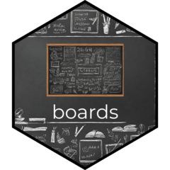

# boards 

<!-- badges: start -->
<!-- badges: end -->

The goal of boards is to manage data from many projects. boards uses pins package.

## Installation

You can install the development version of boards from [GitHub](https://github.com/) with:

``` r
# install.packages("devtools")
devtools::install_github("pawelqs/boards")
```

## Example

This is a basic example which shows you how to solve a common problem:

``` r
library(boards)
read_pin()
```

